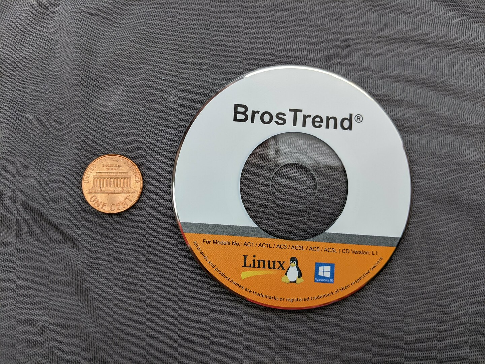

[](https://hits.seeyoufarm.com)

# Repo Status

Ready for use. Run the 1 or 3-line installation command below. Also, the entire disk which came with the Wifi adapter is in this repo.

**I am VERY impressed with the easy installation process and their timely and competent email customer support for Linux! _This is hands-down my "go-to" high-speed Wifi adapter for Linux! This is hands-down the best modern WiFi adapter on the market today (as of Mar. 2021) for Linux!_**

TLDR;

Run this one single command to install the driver in Linux. Follow the instructions in its prompts:
```bash
sh -c 'busybox wget deb.trendtechcn.com/install -O /tmp/install && sh /tmp/install'
```


# Table of Contents
<details>
<summary><b>(click to expand or hide)</b></summary>
<!-- MarkdownTOC -->

1. [All of my Wifi adapter repos:](#all-of-my-wifi-adapter-repos)
1. [BrosTrendWifiAdapterSoftware](#brostrendwifiadaptersoftware)
    1. [Install drivers in Linux Ubuntu](#install-drivers-in-linux-ubuntu)
    1. [How to Disable your internal WiFi card](#how-to-disable-your-internal-wifi-card)
    1. [How I copied the entire disk to my Linux Ubuntu laptop](#how-i-copied-the-entire-disk-to-my-linux-ubuntu-laptop)
    1. [Emailed feedback that BrosTrend/TrendTech send me directly after they read this very readme](#emailed-feedback-that-brostrendtrendtech-send-me-directly-after-they-read-this-very-readme)

<!-- /MarkdownTOC -->
</details>


<a id="all-of-my-wifi-adapter-repos"></a>
# All of my Wifi adapter repos:

- **If you are using Linux and desire a high-speed WiFi adapter, I recommend [this BrosTrend Wifi adapter](https://amzn.to/33qXt9i) above all others! It installs with a simple 1-line or 3-line command and has an excellent installation script, as well as great performance, speed, and range.** 
- If you are using Linux and need a Wifi adapter which is _plug-and-play_ and requires NO driver installation, _and_ are okay with it being a bit slower than the BrosTrend one above, then buy a [Panda Wifi adapter like this one](https://amzn.to/2Q0JnZd) instead.

My Wifi Repositories:
1. [BrosTrendWifiAdapterSoftware](https://github.com/ElectricRCAircraftGuy/BrosTrendWifiAdapterSoftware) - (BEST WIFI ADAPTER FOR LINUX, HANDS-DOWN!)
1. [AlfaWiFiAdapterSoftware](https://github.com/ElectricRCAircraftGuy/AlfaWiFiAdapterSoftware)
1. [RealtekWiFiAdapterSoftware](https://github.com/ElectricRCAircraftGuy/RealtekWiFiAdapterSoftware)


<a id="brostrendwifiadaptersoftware"></a>
# BrosTrendWifiAdapterSoftware
Software that comes on the mini CD (which is inconvenient) with BrosTrend WiFi adapters, and my personal installation notes for Linux.

Here is the adapter I purchased for $36 from Amazon in Mar. 2021: [BrosTrend AC1200 2.4GHz/5GHz WiFi adapter, Model No. AC3L](https://www.amazon.com/gp/product/B07FCN6WGX?ie=UTF8&psc=1&linkCode=ll1&tag=wwwel-20&linkId=b7839451620775257a522bc50b9a33b5&language=en_US&ref_=as_li_ss_tl):

<p align="left" width="100%">
    <a href="https://www.amazon.com/gp/product/B07FCN6WGX?ie=UTF8&psc=1&linkCode=ll1&tag=wwwel-20&linkId=b7839451620775257a522bc50b9a33b5&language=en_US&ref_=as_li_ss_tl">
         
    </a>
</p>

Stickers that came on the packaging:

> With Linux Support Ticket,  
> Please include your Amazon  
> order number, send E-mail to:  
> support@trend-tech.net.cn.

> Model No.: AC3L  
> For Linux

Main product page for Model No. AC3L: https://www.trendtechcn.com/Product.aspx?ProductId=329.

Disk that came with it:

<p align="left" width="100%">
    <a href="Driver_and_Manual_disk" title="Click to browse BrosTrend Driver_and_Manual_disk files">
         
    </a>
</p>

Linux manual that came on the disk: [BrosTrend_WiFi_Adapter_Linux_Manual_20200303.pdf](Driver_and_Manual_disk/01_Linux/BrosTrend_WiFi_Adapter_Linux_Manual_20200303.pdf) <== refer to this for instructions and information for Linux!


<a id="install-drivers-in-linux-ubuntu"></a>
## Install drivers in Linux Ubuntu

The install script is found online here: https://deb.trendtechcn.com/install. You can download and run it on Linux like this:

```bash
wget deb.trendtechcn.com/install -O install
chmod +x install
./install
```

The above commands is how I did it. Or, you can use their command exactly, as they specify in their Linux PDF just above, like this:

```bash
sh -c 'busybox wget deb.trendtechcn.com/install -O /tmp/install && sh /tmp/install'
```

The install script appears to be very well-written and well-tested, which is extremely unusual for WiFi adapters on Linux. They obviously want this to work and be easy, and are clearly trying to get our business. During the install process, it asks you to select your WiFi adapter model or plug it in so it can read the `dmesg` output and auto-detect it. _If you have the adapter, the version number is printed very clearly on the bottom of it._ Even easier though, just do like the script says and plug it in and press Enter. For my case, I have the Model No. `AC3` Version No. `V2`, so it automatically downloaded, compiled, and installed this driver for me: https://deb.trendtechcn.com/rtl88x2bu-dkms.deb.

At the end of the installation, which took just a few minutes, it said:

```
=====================================================
 The driver was successfully installed!
 We'd appreciate an Amazon product review:
 https://www.amazon.com/review/create-review/listing
=====================================================
```

So, I'm going to do like they asked and leave a review here: https://www.amazon.com/review/create-review/listing. 

**I am VERY impressed with the easy installation process and BrosTrend's top-notch _Linux driver_ support for this device!**

<a id="how-to-disable-your-internal-wifi-card"></a>
## How to Disable your internal WiFi card

Source: 

1. [See my answer #1 on AskUbuntu here](https://askubuntu.com/questions/168032/how-to-disable-built-in-wifi-and-use-only-usb-wifi-card/1320155#1320155).
1. [or my answer #2 on AskUbuntu here][my-ans-num2].
    1. My answer #2 comes from BrosTrend TrendTech directly, here: https://deb.trendtechcn.com/advanced/internal-adapters/.

My own notes:

Now, to turn off your internal wifi adapter and use this one, do the following. _Note that you'll have to run the `sudo ip link set wlan0 down` command to disable the internal WiFi each and every time you reboot and want to use solely this external adapter, so you might consider adding that command to a startup script if you want to always use this external adapter after each boot._ 

1. Unplug the external adapter, and run `iwconfig` to see what your internal adapter is named. Mine shows `wlan0`. 
1. Turn off that internal adapter:
    ```bash
    sudo ip link set wlan0 down
    ```
1. Now plug in your BrosTrend external adapter. Optionally run `iwconfig` again to see what it is called, just for informational/awareness purposes. Mine showed `wlx4401bb9e35a8` one time, for some reason, but now just shows `wlan1`.
1. Click the top-right corner of your screen in Ubuntu to open the drop-down menu to connect to WiFi. Connect with the external adapter. It's hard to tell which adapter is which, as it will show both adapters, but the external one should show networks available since it is NOT disabled, while the internal one should show nothing. You may have to play around with it, possibly unplugging the external one and plugging it back in again. Just run `iwconfig` and/or unplug the external adapter and run it again to see what's going on with the two adapters if needed, and disable/re-enable the internal one as required. You may have to wait a minute or so for the network list for the new adapter to be populated as you try to connect it to a network, **or, if you have issues reconnecting after messing with which adapter you are trying to use to connect, just reboot your computer.** I'm not entirely sure, but **it _may_ be that if your `iwconfig` shows the external adapter as `wlan1` or similar instead of `wlx4401bb9e35a8`, then you need to reboot to fix the error** (and re-disable the internal WiFi adapter again too, if necessary, after the reboot). **Update: it is also worth messing around inside the "Advanced Network Configuration" GUI via `nm-connection-editor` to see if you can get a non-functioning adapter working there. See also the notes from BrosTrend/TrendTech about this tool, which they emailed me, below.**
1. If you ever need to turn the internal WiFi adapter back on, you can do it with:
    ```bash
    sudo ip link set wlan0 up
    ```

_Note: if you never want to use your internal WiFi card, you can try disabling it entirely in your BIOS/UEFI settings, which you access manually at boot-time, if your system allows it._ You might also try [this answer here](https://askubuntu.com/questions/168032/how-to-disable-built-in-wifi-and-use-only-usb-wifi-card/168046#168046), or, even better, the BrosTech-recommended solution I've documented [in my answer here][my-ans-num2].


<a id="how-i-copied-the-entire-disk-to-my-linux-ubuntu-laptop"></a>
## How I copied the entire disk to my Linux Ubuntu laptop

1. I used [this external CD/DVD drive which I bought for $27 from Amazon](https://www.amazon.com/gp/product/B08B3SCV18?ie=UTF8&psc=1&linkCode=ll1&tag=wwwel-20&linkId=3d0648e4deeb651fe0ae63f4cc43a2e8&language=en_US&ref_=as_li_ss_tl). It works great! It was plug-and-play on Linux Ubuntu, and required no special setup. I just plugged it into a single USB 3.0 port, from where it drew power as well, and it worked with no problem. 
1. Here is how I copied the entire contents of the DVDs above on my Linux Ubuntu computer, FROM directory `/media/gabriel/Driver&Manual` TO directory `~/GS/dev/BrosTrendWifiAdapterSoftware`:

    ```bash
    # First, do a dry run to make sure the statistics summary at the end all looks good, and that
    # "Number of deleted files" (meaning: files it's going to delete from your destination directory)
    # is 0.
    time rsync -rah --dry-run --info=progress2 --stats '/media/gabriel/Driver&Manual' ~/GS/dev/BrosTrendWifiAdapterSoftware

    # When ready, remove the `--dry-run` flag above to actually do the copy. In the event there are any
    # disk read errors, simply re-run this command repeatedly until you no longer get any errors and it
    # all passes. Any read errors will show up live in the `rsync` terminal output while the command
    # runs. If you get read errors, you may need to clean the disk and try again. `rsync` is great in
    # that it scans for and only copies changes between source and destination, which makes it as though
    # it can pick up where it left off, so re-running the command is usually very fast.
    time rsync -rah --info=progress2 --stats '/media/gabriel/Driver&Manual' ~/GS/dev/BrosTrendWifiAdapterSoftware

    # Once done copying, add (`+`) read/write (`rw`) privileges for your user and group (`ug`) to all
    # files you just copied (in the destination directory), like this. This allows you to be able to
    # move, modify, rename, etc. them as you see fit using your favorite file manager, such as nemo (my
    # favorite; see here for how to install it: https://askubuntu.com/a/1173861/327339) or nautilus (the
    # default that comes with Ubuntu).
    cd ~/GS/dev/BrosTrendWifiAdapterSoftware
    chmod -R ug+rw 'Driver&Manual'
    ```


<a id="emailed-feedback-that-brostrendtrendtech-send-me-directly-after-they-read-this-very-readme"></a>
## Emailed feedback that BrosTrend/TrendTech send me directly after they read this very readme

My email to them 7 Mar. 2021 1:10am:

> Thanks. It seems to work. Can you please verify my bold comments under step 4 here, and tell me if they are right? https://github.com/ElectricRCAircraftGuy/BrosTrendWifiAdapterSoftware#disable-your-internal-wifi-card-source-see-my-answer-here.
> 
> In particular:
> 
> > it may be that if your `iwconfig` shows the external adapter as `wlan1` or similar instead of `wlx4401bb9e35a8`, then you need to reboot to fix the error
> 
> Thanks!


**Their response to me on 7 Mar. 2021 7:42am** (I've done some very minor formatting and other small corrections to make this easier to read). **They have some great points here, especially in bullets 2 and 3!**

> Hi Gabriel,
> 
> Thank you for the detailed instructions and your good words about our
> installation process there.  
> Here are some remarks while reading them:
> 
> 1. No need for chmod.
> 
>     > ```bash
>     > chmod +x install
>     > ./install
>     > ```
> 
>     Instead of these, you can do this, like our instructions say:
>     ```bash
>     sh install
>     ```
> 
>     I.e. there's no need to use `chmod` in order to run a script via `sh`.
> 
> 2. Documentation about disabling internal adapters. We have that here; it relies on module blacklisting: https://deb.trendtechcn.com/advanced/internal-adapters/.
> 
> 3. The network manager `nm-connection-editor` dialog \[GUI] (run that from a
> terminal to see which one I mean) has a "Device" combo box, where you
> can set a MAC address in order to limit one wifi connection to a
> specific adapter, or you can leave it empty if you want it to work with
> any adapter.  
> So normally there's no need to disable the internal adapter at all.
> 
> 4. The `wlan0` vs `wlx4401bb9e35a8` name difference is caused by a kernel
> option called `net.ifnames=0`. You can read more about it here:
> https://wiki.debian.org/NetworkInterfaceNames.
> 
> 5. Note that if someone has a laptop and presses e.g. **Fn** + **F5** to disable
> wifi, this may disable the [external] USB adapters too, confusing users.
> 
> 6. Another way to copy a CDROM is:
>     ```bash
>     sudo dd if=/dev/sr0 of=trendtechcn-cd.iso bs=128k status=progress
>     ```
> 
> Greetings from a fellow Linux enthusiast! :)
> 
> Best regards,
> **** from BrosTrend technical support team
> Please click "Reply to All" when replying to this email


----

Disclaimer required by Amazon:  
_We are a participant in the Amazon Services LLC Associates Program, an affiliate advertising program designed to provide a means for us to earn fees by linking to Amazon.com and affiliated sites._  
I make virtually nothing from Amazon in this way, but I must include this disclaimer anyway. 

  [my-ans-num2]: https://askubuntu.com/questions/168032/how-to-disable-built-in-wifi-and-use-only-usb-wifi-card/1321922#1321922
